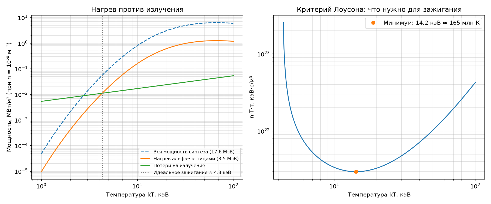
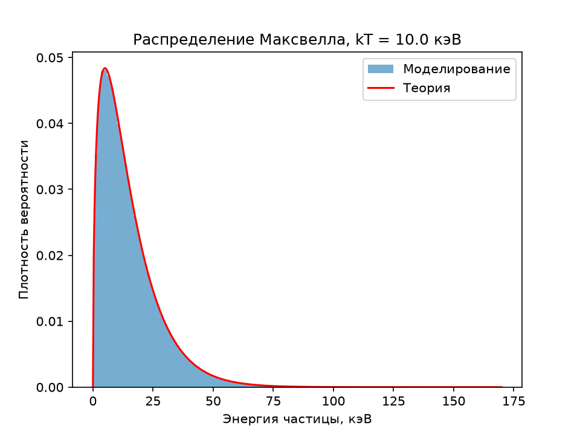
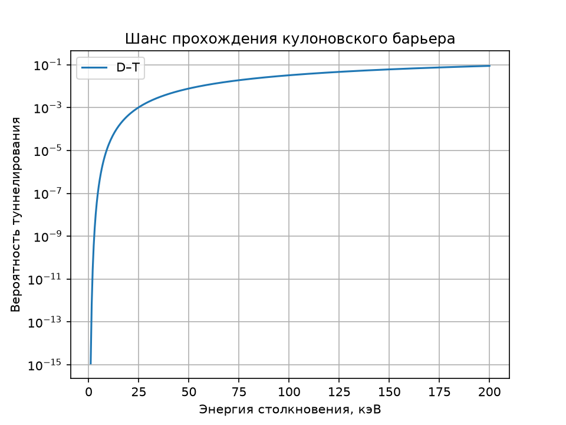
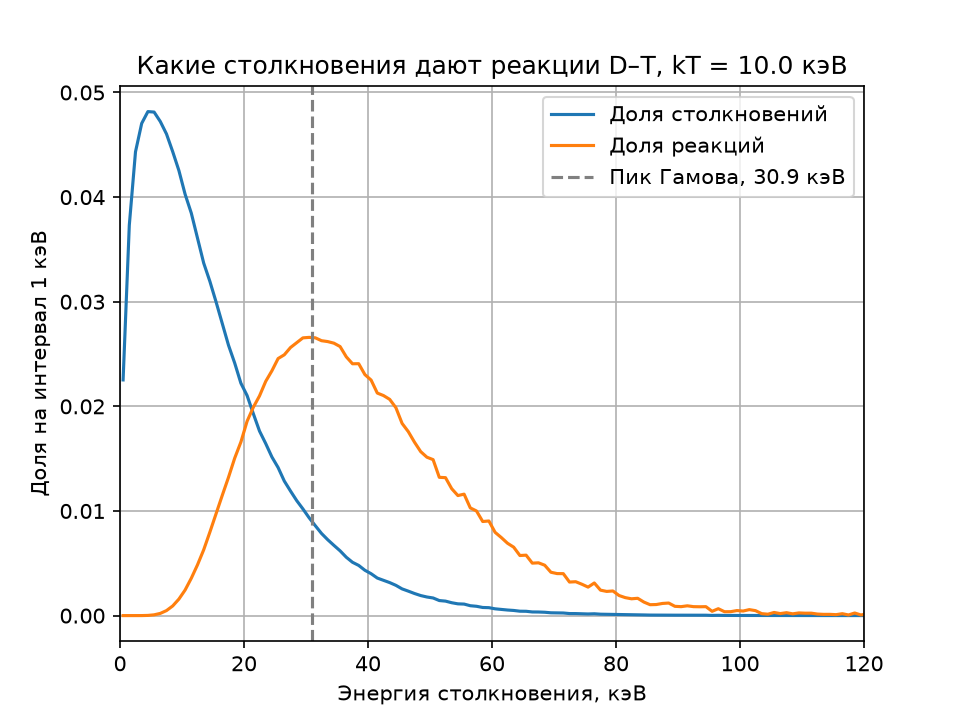
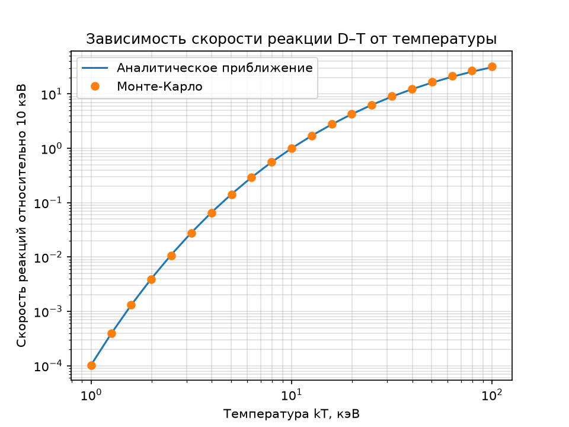

# Fusion Monte Carlo: моделирование условий положительного энергетического выхода реакции D–T

Почему для термоядерного синтеза нужны температуры порядка ста миллионов градусов? Этот проект шаг за шагом отвечает на вопрос с помощью моделирования методом Монте-Карло на C++ и визуализации на Python.



## Что такое термоядерный синтез

Термоядерный синтез — это слияние лёгких атомных ядер в более тяжёлое. Масса образовавшегося ядра немного меньше суммы масс исходных, и эта разница по формуле E = mc² превращается в энергию. Именно так светят Солнце и другие звёзды.

Для земной энергетики самая перспективная реакция — слияние двух изотопов водорода, дейтерия (D) и трития (T):

D + T → ⁴He (3.5 МэВ) + n (14.1 МэВ)

Каждая такая реакция выделяет 17.6 МэВ. В пересчёте на килограмм топлива это примерно в десять миллионов раз больше энергии, чем при сжигании угля или газа.

## Почему это актуально

Управляемый термоядерный синтез называют одной из главных нерешённых задач энергетики:

- **Практически неисчерпаемое топливо.** Дейтерий добывают из обычной морской воды, а тритий можно получать из лития прямо в реакторе.
- **Нет выбросов CO₂.** Продукт реакции — гелий, инертный и безопасный газ. Это делает синтез потенциальным решением проблемы изменения климата.
- **Высокая безопасность.** В отличие от реакций деления в атомных станциях, здесь нет цепной реакции, которая может выйти из-под контроля: при любом сбое плазма просто остывает и реакция прекращается. Не образуется и долгоживущих высокоактивных отходов, как у отработанного ядерного топлива.

Работы над термоядерным реактором ведутся с 1950-х годов, и в последние годы произошли важные события. В декабре 2022 года на лазерной установке NIF (США) впервые в управляемом эксперименте получили больше энергии синтеза, чем было доставлено лазерами в топливо: 3.15 МДж против 2.05 МДж. Во Франции строится международный токамак ITER, который должен продемонстрировать устойчивое горение плазмы, а в мире появилось множество частных компаний, разрабатывающих собственные реакторы.

## Главная проблема: почему это так трудно

Оба ядра заряжены положительно и отталкиваются друг от друга. Чтобы слиться, им нужно сблизиться, преодолев кулоновский барьер, а для этого налететь друг на друга с огромной скоростью. Единственный способ разогнать огромное число ядер одновременно — нагреть вещество до состояния плазмы, где температура измеряется десятками и сотнями миллионов градусов. Это во много раз горячее центра Солнца.

Но нагреть мало. Горячая плазма постоянно теряет энергию: светится (тормозное излучение) и отдаёт тепло окружающим стенкам. Реактор имеет смысл, только если реакции выделяют больше энергии, чем уходит на поддержание плазмы. Отношение выделенной энергии к затраченной обозначают Q, и цель всех установок — добиться Q > 1, а для электростанции — гораздо больше.

## Цель и задачи проекта

**Цель:** с помощью компьютерного моделирования показать, откуда берутся требования к температуре термоядерной плазмы, и найти, при какой температуре реакция D–T может окупать сама себя.

**Задачи:**

1. Смоделировать распределение энергий частиц в горячей плазме.
2. Описать вероятность слияния ядер через квантовое туннелирование сквозь кулоновский барьер.
3. Выяснить, какие именно столкновения дают основной вклад в реакции (пик Гамова).
4. Найти зависимость скорости реакции от температуры.
5. Сравнить нагрев плазмы от синтеза с потерями и найти условия зажигания: идеальную температуру зажигания и минимум критерия Лоусона.

## Почему метод Монте-Карло

Поведение плазмы определяется миллиардами случайных столкновений, и у каждого своя энергия. Метод Монте-Карло позволяет воспроизвести эту случайность напрямую: сгенерировать большое число «виртуальных» столкновений с правильным распределением энергий и усреднить результат. Такой подход наглядно показывает, какие именно частицы отвечают за реакции, а там, где есть точные формулы, его легко проверить.

## Основные результаты

| Величина | Результат |
|---|---|
| Средняя энергия частиц при kT = 10 кэВ (моделирование / теория) | 15.008 кэВ / 15 кэВ |
| Средняя энергия столкновений, дающих реакцию, при kT = 10 кэВ | ≈ 39 кэВ |
| Пик Гамова при kT = 10 кэВ | ≈ 31 кэВ |
| Скорость реакции при 1 кэВ относительно 10 кэВ | ≈ 10⁻⁴ |
| Температура идеального зажигания (нагрев альфа-частицами = излучение) | ≈ 4.3 кэВ ≈ 50 млн К |
| Минимум тройного произведения Лоусона nTτ | ≈ 3·10²¹ кэВ·с/м³ при 14.2 кэВ ≈ 165 млн К |

**Вывод:** около 50 миллионов градусов — теоретический минимум, при котором нагрев от синтеза вообще может перекрыть потери на излучение. Поскольку реальная плазма ещё и теряет тепло, зажечь её проще всего при 10–20 кэВ, то есть 100–200 миллионах градусов. Именно на такой диапазон рассчитаны токамаки вроде ITER.

## Этапы

Каждый этап — отдельная программа на C++ (папка `src`), которая записывает результаты в CSV-файл, и скрипт на Python (папка `plots`), который строит по ним график. Этапы идут от простого к сложному: каждый следующий использует результаты предыдущих.

### Этап 1. Распределение Максвелла: как движутся частицы в плазме

**Вопрос.** Что значит «плазма нагрета до температуры T» на уровне отдельных частиц?

**Физика.** Температура — это мера средней энергии хаотического движения частиц. При этом частицы движутся не одинаково: одни медленные, другие быстрые. В состоянии теплового равновесия каждая компонента скорости ($v_x$, $v_y$, $v_z$) — независимая нормальная случайная величина со средним 0 и стандартным отклонением

$$\sigma = \sqrt{kT/m},$$

где $m$ — масса частицы. Энергии частиц при этом подчиняются распределению Максвелла, а средняя энергия равна $\frac{3}{2}kT$.

**Моделирование.** Для температуры kT = 10 кэВ (около 116 млн градусов) генерируется миллион дейтронов: для каждого три случайные компоненты скорости, по ним кинетическая энергия $E = \frac{1}{2}m(v_x^2 + v_y^2 + v_z^2)$. Результаты сравниваются с теорией.

**Результат.** Средняя энергия получилась 15.008 кэВ при теоретических 15 кэВ, а гистограмма энергий совпала с теоретической кривой. Наиболее вероятная энергия — около 5 кэВ ($kT/2$), но у распределения длинный «хвост»: небольшая доля частиц имеет энергии в несколько раз выше средней, до 150 кэВ и больше. Как покажут следующие этапы, именно этот хвост отвечает за синтез.



### Этап 2. Туннелирование: какой шанс у двух ядер слиться

**Вопрос.** Если два ядра столкнулись с энергией E, с какой вероятностью они сольются?

**Физика.** Ядра D и T заряжены положительно и отталкиваются. Высота кулоновского барьера между ними — сотни кэВ, а типичная энергия частиц в плазме — единицы и десятки кэВ. По законам классической физики слияние было бы невозможно. Но в квантовой механике частица может «просочиться» сквозь барьер, даже не имея энергии, чтобы через него перелететь, — это туннелирование. Его вероятность описывает фактор Гамова:

$$P(E) = \exp\left(-\sqrt{\frac{E_G}{E}}\right),$$

где $E_G$ — энергия Гамова. Она зависит от зарядов и масс ядер и для пары D–T равна примерно 1182 кэВ.

**Моделирование.** Вероятность вычисляется для энергий от 1 до 200 кэВ с шагом 0.5 кэВ. Случайность здесь не нужна: это расчёт по формуле, который подготавливает функцию для следующих этапов.

**Результат.** Вероятность растёт с энергией чрезвычайно резко:

| Энергия столкновения | Вероятность туннелирования |
|---|---|
| 1 кэВ | 1.2·10⁻¹⁵ |
| 10 кэВ | 1.9·10⁻⁵ |
| 100 кэВ | 0.032 |

При росте энергии в 100 раз вероятность увеличивается примерно в 3·10¹³ раз. Медленным ядрам слиться практически невозможно, быстрым — вполне реально.



### Этап 3. Пик Гамова: какие столкновения на самом деле дают реакции

**Вопрос.** Этапы 1 и 2 тянут в разные стороны: медленных частиц много, но у них нет шансов, а быстрых частиц мало, но шансы высоки. Кто в итоге даёт больше всего реакций?

**Физика.** Сталкиваются пары ядер, поэтому важна энергия их относительного движения. Она описывается через приведённую массу $m_r = \frac{m_D m_T}{m_D + m_T}$ и тоже подчиняется распределению Максвелла. Число реакций пропорционально произведению сечения реакции на скорость, $\sigma(E) \cdot v$. В используемой модели сечение $\sigma(E) \propto P(E)/E$, а скорость $v \propto \sqrt{E}$, поэтому вклад одного столкновения в скорость реакции пропорционален

$$w(E) = \frac{P(E)}{\sqrt{E}}.$$

**Моделирование.** Генерируется миллион столкновений D–T при kT = 10 кэВ. Каждому столкновению приписывается вес $w(E)$, после чего результаты раскладываются по интервалам энергии шириной 1 кэВ прямо в программе на C++. Получаются две гистограммы: какая доля столкновений и какая доля реакций приходится на каждую энергию.

**Результат.**

- Столкновения сосредоточены около нескольких кэВ, а реакции — вокруг пика Гамова $E_0 = (\sqrt{E_G} \cdot kT / 2)^{2/3} \approx 31$ кэВ, в шесть раз правее.
- Средняя энергия всех столкновений — 15 кэВ, а средняя энергия столкновений, которые дают реакцию, — около 39 кэВ.
- Ниже 10 кэВ реакций практически нет, хотя там почти половина всех столкновений.

Среднее (39 кэВ) больше пика (31 кэВ), потому что распределение реакций несимметрично: слева оно круто обрывается, а справа тянется длинный хвост. Основную работу выполняют не типичные частицы, а редкие энергичные из хвоста распределения Максвелла. Шум в правой части графика — статистическая погрешность Монте-Карло: в хвост попадает мало столкновений, и случайные колебания их числа заметны.



### Этап 4. Скорость реакции в зависимости от температуры

**Вопрос.** Насколько быстро растёт число реакций при нагреве плазмы?

**Физика.** Скорость реакции $\langle \sigma v \rangle$ — это среднее значение «сечение × скорость» по всем столкновениям. Она определяет, сколько реакций происходит в единице объёма за секунду. Для используемой модели существует аналитическое приближение (метод перевала):

$$\langle \sigma v \rangle \propto T^{-2/3} \exp\left(-3\left(\frac{E_G}{4kT}\right)^{1/3}\right).$$

**Моделирование.** Для 21 температуры от 1 до 100 кэВ (равномерно в логарифмическом масштабе) генерируется по 200 000 столкновений, и скорость реакции оценивается как средний вес $w(E)$. Энергии генерируются напрямую из гамма-распределения с параметром формы 3/2 и масштабом $kT$ — это то же распределение Максвелла, что на этапе 1, но без промежуточного расчёта скоростей. Абсолютное значение в модели неизвестно, поэтому результаты нормируются на значение при 10 кэВ.

**Результат.** Точки Монте-Карло совпадают с аналитическим приближением во всём диапазоне, что подтверждает правильность моделирования.

- При нагреве от 1 до 10 кэВ скорость реакции растёт примерно в 10 000 раз.
- От 10 до 100 кэВ рост замедляется и составляет десятки раз.

Для сравнения: температура в центре Солнца около 1.3 кэВ, в области, где реакций в тысячи раз меньше, чем при 10 кэВ. Солнцу этого хватает благодаря огромному объёму и гравитационному удержанию плазмы в течение миллиардов лет. На Земле плазму удаётся удерживать лишь доли секунды, поэтому температуру приходится поднимать в десятки раз выше солнечной.



### Этап 5. Энергетический баланс и критерий Лоусона

**Вопрос.** При какой температуре синтез начинает окупать себя?

**Физика.** У плазмы есть «доход» и «расходы» энергии.

- **Нагрев от синтеза.** Из 17.6 МэВ каждой реакции 14.1 МэВ уносит нейтрон. Он не имеет заряда, свободно вылетает из плазмы и нагревать её не может. Плазму греет только альфа-частица (ядро гелия) с энергией 3.5 МэВ. Для смеси D–T 50/50 с плотностью ядер $n$ мощность нагрева равна $P_\alpha = \frac{n^2}{4} \langle \sigma v \rangle E_\alpha$.
- **Тормозное излучение.** Электроны, пролетая мимо ядер, тормозятся и испускают рентгеновское излучение, которое уносит энергию: $P_{br} = C_B n^2 \sqrt{T}$, где $C_B = 5.35 \cdot 10^{-37}$ Вт·м³·кэВ⁻¹ᐟ².
- **Утечка тепла.** Тепловая энергия плазмы $3nkT$ уходит к стенкам за характерное время удержания энергии $\tau_E$.

Здесь нужны абсолютные значения скорости реакции, а упрощённая модель этапов 2–4 не учитывает ядерный множитель. Поэтому используется формула Бош–Хейла (1992) — аппроксимация экспериментальных данных, стандартная в физике плазмы. Мощности рассчитываются для плотности $n = 10^{20}$ м⁻³, типичной для токамаков.

**Условия.**

1. **Идеальное зажигание:** даже при идеальном удержании нагрев должен перекрывать излучение, $P_\alpha \geq P_{br}$. Обе величины пропорциональны $n^2$, поэтому плотность сокращается, и ответ зависит только от температуры.
2. **Критерий Лоусона:** с учётом утечки тепла нужно $P_\alpha - P_{br} \geq 3nkT/\tau_E$. Отсюда получается минимальное тройное произведение плотности, температуры и времени удержания:

$$nT\tau_E \geq \frac{3kT \cdot T}{\frac{1}{4}\langle \sigma v \rangle E_\alpha - C_B \sqrt{T}}.$$

**Результат.**

- Нагрев перекрывает излучение начиная с **4.3 кэВ ≈ 50 млн градусов**. Ниже этой температуры плазма остывает быстрее, чем греется, при любом удержании.
- Тройное произведение минимально при **14.2 кэВ ≈ 165 млн градусов** и равно около 3·10²¹ кэВ·с/м³. При более низких температурах мало реакций, при более высоких становится слишком много тепловой энергии, которую нужно удерживать.
- Полная мощность синтеза достигает максимума около 65 кэВ и затем слегка падает. Это проявление резонанса реакции D–T, который упрощённая модель этапов 2–4 не учитывает.

Эти числа и дают ответ на главный вопрос проекта: 50 миллионов градусов — абсолютный минимум, а на практике выгоднее всего работать при 100–200 миллионах градусов, на которые и рассчитаны современные токамаки. График приведён в начале страницы.

## Сборка и запуск

Нужны: компилятор C++17, CMake ≥ 3.16 и Python 3 с библиотеками `numpy`, `pandas` и `matplotlib`.

```bash
git clone https://github.com/JolikSS/Fusion-Monte-Carlo-simulating-conditions-for-net-energy-gain-in-D-T-fusion.git
cd Fusion-Monte-Carlo-simulating-conditions-for-net-energy-gain-in-D-T-fusion

cmake -S . -B build
cmake --build build

# каждая программа записывает результаты в CSV-файл в текущей папке
./build/fusion_sim   # этап 1 -> maxwell.csv
./build/tunneling    # этап 2 -> tunneling.csv
./build/gamow        # этап 3 -> gamow.csv
./build/rate         # этап 4 -> rate.csv
./build/balance      # этап 5 -> balance.csv

# скрипты читают CSV-файлы из текущей папки
pip install numpy pandas matplotlib
python plots/PlotMaxwell.py
python plots/PlotTunneling.py
python plots/PlotGamow.py
python plots/PlotRate.py
python plots/PlotBalance.py
```

Во всех моделированиях зафиксировано начальное состояние генератора (seed = 42), поэтому результаты воспроизводимы.

## Структура проекта

```
├── CMakeLists.txt
├── src/
│   ├── main.cpp         # этап 1: распределение Максвелла
│   ├── tunneling.cpp    # этап 2: вероятность туннелирования
│   ├── gamow.cpp        # этап 3: пик Гамова
│   ├── rate.cpp         # этап 4: скорость реакции от температуры
│   └── balance.cpp      # этап 5: энергетический баланс, критерий Лоусона
├── plots/               # скрипты на Python для графиков
└── figures/             # готовые графики
```

## Ограничения модели

- На этапах 2–4 используется упрощённое сечение σ(E) ∝ P(E)/E без ядерного S-фактора. Оно хорошо воспроизводит температурную зависимость примерно до 20 кэВ, но не учитывает резонанс D–T около 64 кэВ.
- На этапе 5 плазма считается смесью D–T в пропорции 50/50 с одинаковой температурой ионов и электронов; учитываются только тормозное излучение и утечка тепла (без примесей, линейчатого и циклотронного излучения).
- В этапах с Монте-Карло основной вклад даёт хвост распределения, но частицы из него генерируются редко, поэтому при высоких энергиях заметен статистический шум.

## Возможные улучшения

- Выборка по значимости (importance sampling) для уменьшения шума в хвосте распределения
- Сравнение реакций D–T, D–D и D–³He
- Общий заголовочный файл для повторяющихся функций и модульные тесты
- Подключение ядра на C++ к Python через pybind11

## Литература

- H.-S. Bosch, G. M. Hale, *Improved formulas for fusion cross-sections and thermal reactivities*, Nuclear Fusion 32, 611 (1992)
- J. D. Lawson, *Some criteria for a power producing thermonuclear reactor*, Proc. Phys. Soc. B 70, 6 (1957)
- J. P. Freidberg, *Plasma Physics and Fusion Energy*, Cambridge University Press (2007)

## Лицензия

MIT
